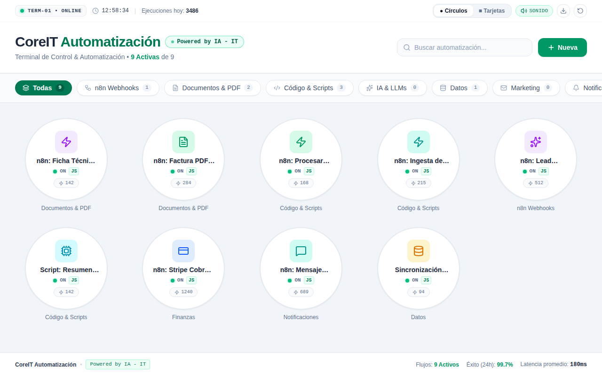
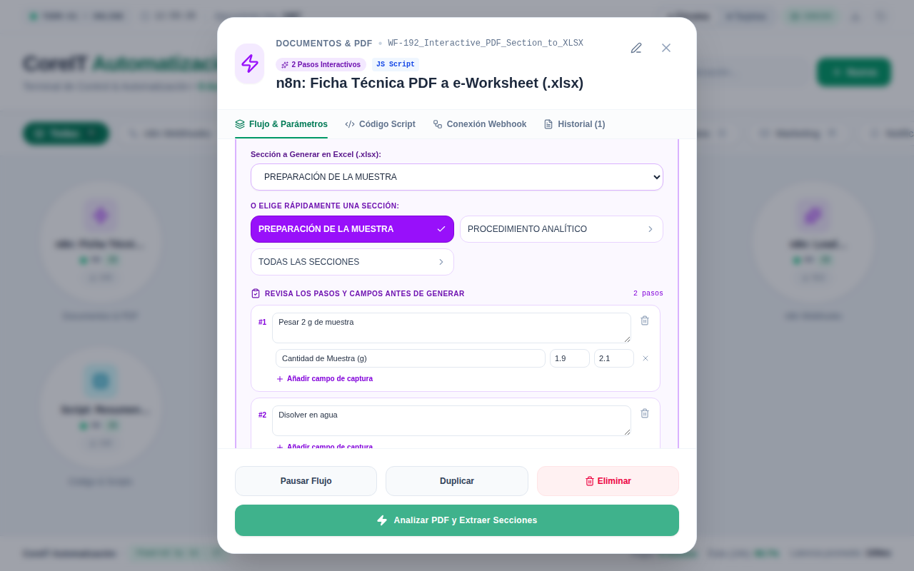

# CoreIT — Hub de automatizaciones

Producto propio de EG Solutions: una interfaz tipo punto de venta donde cada empresa lanza sus automatizaciones con un toque. La interfaz es React y la lógica pesada (extracción de documentos, IA y generación de archivos) corre en workflows de n8n.

> **Estado:** prototipo. Las automatizaciones y los contadores que trae de serie son **datos de demo**. Aún no tiene usuarios, multiempresa ni persistencia en servidor: todo se guarda en el navegador (`localStorage`).



## Qué hace

- Cuadrícula de automatizaciones con filtros por categoría, búsqueda y vista en círculos o tarjetas.
- Crear, editar, duplicar y pausar automatizaciones. Cada una puede ser un webhook de n8n o un script propio.
- Historial de ejecuciones con registro paso a paso y descarga de resultados (`.xlsx`, `.csv` o `.json`).
- **Flujo real PDF → e-Worksheet (.xlsx)** con revisión humana antes de generar el archivo (ver abajo).



## Stack

React 19 · TypeScript · Vite · Tailwind CSS 4 · n8n (webhooks) · ExcelJS y LLM dentro del workflow de n8n

## Desarrollo

```bash
npm install
npm run dev     # http://localhost:3000
npm run lint    # comprobación de tipos
```

## Flujo real: PDF → e-Worksheet (.xlsx) con n8n

La automatización **"n8n: Ficha Técnica PDF a e-Worksheet (.xlsx)"** (salida *Selección Interactiva*) llama al workflow de n8n en dos pasos:

1. **Análisis:** el hub envía el PDF (`multipart/form-data`, campo `data`) a la URL del webhook del paso 1. n8n devuelve `{ status: "requires_input", titulo_ficha, secciones_detectadas, todos_los_bloques }`. Si el modelo devuelve un JSON inválido, n8n responde `{ status: "error", message }` y el hub **reintenta una vez**.
2. **Revisión humana:** en el hub eliges la sección y revisas los pasos y los campos de captura. Puedes editar textos, etiquetas y límites, quitar pasos o añadir campos.
3. **Generación:** el hub envía `{ seccion_seleccionada, titulo_ficha, todos_los_bloques }` (ya revisados) a la URL del paso 2 y descarga el `.xlsx` que devuelve n8n.

### Configuración
- **En el hub:** Editar la automatización → pestaña de red/webhook → **URL Webhook de n8n** (paso 1) y **URL Webhook del paso 2**. Usa las URLs de *producción* de los nodos Webhook del workflow.
- **En n8n:** los dos nodos Webhook deben permitir CORS (*Options → Allowed Origins (CORS)*: el dominio del hub o `*`) y el workflow debe estar activo.

Si las URLs siguen siendo las de ejemplo (`tu-servidor`), la automatización funciona en **modo demo** con datos de muestra.
